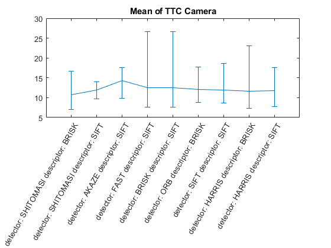
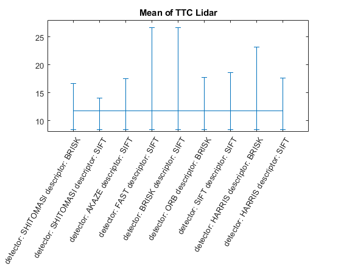

# SFND 3D Object Tracking

Welcome to the final project of the camera course. By completing all the lessons, you now have a solid understanding of keypoint detectors, descriptors, and methods to match them between successive images. Also, you know how to detect objects in an image using the YOLO deep-learning framework. And finally, you know how to associate regions in a camera image with Lidar points in 3D space. Let's take a look at our program schematic to see what we already have accomplished and what's still missing.


In this final project, you will implement the missing parts in the schematic. To do this, you will complete four major tasks: 
1. First, you will develop a way to match 3D objects over time by using keypoint correspondences. 
2. Second, you will compute the TTC based on Lidar measurements. 
3. You will then proceed to do the same using the camera, which requires to first associate keypoint matches to regions of interest and then to compute the TTC based on those matches. 
4. And lastly, you will conduct various tests with the framework. Your goal is to identify the most suitable detector/descriptor combination for TTC estimation and also to search for problems that can lead to faulty measurements by the camera or Lidar sensor. In the last course of this Nanodegree, you will learn about the Kalman filter, which is a great way to combine the two independent TTC measurements into an improved version which is much more reliable than a single sensor alone can be. But before we think about such things, let us focus on your final project in the camera course. 

## Comments from Stefan Sicklinger

### FP1 Bouding box matching
 A multimap is used and a filtering of keypoints based on the distance can be performed
```cpp
    double t = (double)cv::getTickCount();
    static double totalTime = 0;
    bool enableDebug = false;
    int currentBoxID;
    int previousBoxID;
    std::multimap<int, int> foundBBmatch; // <currentBoxID,previousBoxID>

    double max_dist = 0;
    double min_dist = 100;
    ///Optional
    //Compute  max and min distances between keypoints
    for (int i = 0; i < matches.size(); i++)
    {
        double dist = matches[i].distance;
        if (dist < min_dist)
            min_dist = dist;
        if (dist > max_dist)
            max_dist = dist;
    }
#ifdef DEBUG
    cout << "Max dist :: " << max_dist << endl;
    cout << "Min dist :: " << min_dist << endl;
#endif // DEBUG
    //Use only "good" matches (i.e. whose distance is less than 10*min_dist ) : deactiavted 1e6
    std::vector<cv::DMatch> good_matches;

    for (int i = 0; i < matches.size(); i++)
    {
        if (matches[i].distance < 10 * min_dist)
        {
            good_matches.push_back(matches[i]);
        }
    }
    ///End Optional: this reduces accumulated time for all images for this function from 80ms to 14ms
#ifdef DEBUG
    cout << "Total number of matches: " << matches.size() << endl;
    cout << "Total number of good matches: " << good_matches.size() << endl;
#endif // DEBUG
    for (size_t i = 0; i < good_matches.size(); ++i)
    {
        //look for a matching bounding box on current frame
        for (size_t k = 0; k < currFrame.boundingBoxes.size(); ++k)
        {

            if (currFrame.boundingBoxes[k].roi.contains(currFrame.keypoints[good_matches[i].trainIdx].pt)) //found a bounding box in current frame
            {
                currentBoxID = currFrame.boundingBoxes[k].boxID;
                //look for a matching bounding box on previous frame
                for (size_t l = 0; l < prevFrame.boundingBoxes.size(); ++l)
                {

                    if (prevFrame.boundingBoxes[l].roi.contains(prevFrame.keypoints[good_matches[i].queryIdx].pt)) //found a bounding box in previous frame -> bounding box match
                    {
                        previousBoxID = prevFrame.boundingBoxes[l].boxID;
                        foundBBmatch.insert({currentBoxID, previousBoxID});
                    }
                }
            }
        }
    }

#ifdef DEBUG
    cout << "Total number of matches found: " << foundBBmatch.size() << endl;

    {
        for (size_t k = 0; k < currFrame.boundingBoxes.size(); ++k)
        {
            if ((currFrame.boundingBoxes[k].lidarPoints.size() != 0))
                std::cout << " Lidar points for bounding box (current frame): " << currFrame.boundingBoxes[k].lidarPoints.size() << " for BoundingBox ID:  " << currFrame.boundingBoxes[k].boxID << std::endl;
        }

        for (size_t l = 0; l < prevFrame.boundingBoxes.size(); ++l)
        {
            if ((prevFrame.boundingBoxes[l].lidarPoints.size() != 0))
                std::cout << " Lidar points for bounding box (previous frame): " << prevFrame.boundingBoxes[l].lidarPoints.size() << " for BoundingBox ID:  " << prevFrame.boundingBoxes[l].boxID << std::endl;
        }
#endif // DEBUG

        for (size_t k = 0; k < currFrame.boundingBoxes.size(); ++k)
        {

#ifdef DEBUG
            std::cout << "=For bounding box (current frame) " << currFrame.boundingBoxes[k].boxID << " there are  " << foundBBmatch.count(currFrame.boundingBoxes[k].boxID) << " matched keypoints." << std::endl;
#endif // DEBUG \
    // Count matches in the previous frame
            std::map<int, unsigned int> helperMap;

            for (auto it = foundBBmatch.equal_range(currFrame.boundingBoxes[k].boxID).first; it != foundBBmatch.equal_range(currFrame.boundingBoxes[k].boxID).second; ++it)
            {
                helperMap[(*it).second]++;
            }
            if (helperMap.size() != 0)
            {
                std::vector<std::pair<int, unsigned int>> helperPairVec;
                for (auto it = helperMap.begin(); it != helperMap.end(); ++it)
                {
#ifdef DEBUG
                    std::cout << "For bounding box (previous frame) " << it->first << " has count " << it->second << std::endl;
#endif // DEBUG
                    helperPairVec.push_back(*it);
                }
                //sort map by value using lambda code
                sort(helperPairVec.begin(), helperPairVec.end(), [=](std::pair<int, unsigned int> &a, std::pair<int, unsigned int> &b) {
                    return a.second < b.second;
                });
#ifdef DEBUG
                std::cout << "First :" << helperPairVec.back().first << " second :" << helperPairVec.back().second << std::endl;
                std::cout << "Bounding box (current frame): " << currFrame.boundingBoxes[k].boxID << " is matched with bounding box (previous frame) " << helperPairVec.back().first << std::endl;
#endif // DEBUG
                if (foundBBmatch.count(currFrame.boundingBoxes[k].boxID) > 0)
                    bbBestMatches.insert(std::pair<int, int>(helperPairVec.back().first, currFrame.boundingBoxes[k].boxID));
            }
        }
#ifdef DEBUG

        for (auto it = bbBestMatches.cbegin(); it != bbBestMatches.cend(); ++it)
        {
            std::cout << it->first << "---" << it->second << endl;
        }
#endif // DEBUG
        t = ((double)cv::getTickCount() - t) / cv::getTickFrequency();
        totalTime = totalTime + t;
        cout << "Matching bounding boxes took " << 1000 * t / 1.0 << " ms" << endl;
        cout << "Matching bounding boxes accu time " << 1000 * totalTime / 1.0 << " ms" << endl;

```
### FP2 TTC Lidar computation using median
Only deltaX is of interest for the equation, therefore median is a good option
```cpp
    // auxiliary variables
    double dT = 1 / frameRate; // time between two measurements in seconds

    std::vector<double> lidarPointsPrevX;
    std::vector<double> lidarPointsCurrX;

    // find closest distance to Lidar points
    double minXPrev = 1e9, minXCurr = 1e9;
    for (auto it = lidarPointsPrev.begin(); it != lidarPointsPrev.end(); ++it)
    {
        minXPrev = minXPrev > it->x ? it->x : minXPrev;
        lidarPointsPrevX.push_back(it->x);
    }

    for (auto it = lidarPointsCurr.begin(); it != lidarPointsCurr.end(); ++it)
    {
        minXCurr = minXCurr > it->x ? it->x : minXCurr;
        lidarPointsCurrX.push_back(it->x);
    }
    double medXPrev = computeMedianDouble(lidarPointsPrevX);
    double medXCurr = computeMedianDouble(lidarPointsCurrX);
    // compute TTC from both measurements
    double TTCmin = minXCurr * dT / (minXPrev - minXCurr);
    cout << "= TTCmin: " << TTCmin << endl;
    TTC = medXCurr * dT / (medXPrev - medXCurr);
```
comparsion minX vs medianX 
```
#1 : LOAD IMAGE INTO BUFFER done
#2 : DETECT & CLASSIFY OBJECTS done
#3 : CROP LIDAR POINTS done
#4 : CLUSTER LIDAR POINT CLOUD done
Shi-Tomasi detection with n=1723 keypoints in 12.1179 ms
#5 : DETECT KEYPOINTS done
BRISK descriptor extraction in 17.0373 ms
#6 : EXTRACT DESCRIPTORS done
#1 : LOAD IMAGE INTO BUFFER done
#2 : DETECT & CLASSIFY OBJECTS done
#3 : CROP LIDAR POINTS done
#4 : CLUSTER LIDAR POINT CLOUD done
Shi-Tomasi detection with n=1759 keypoints in 11.8371 ms
#5 : DETECT KEYPOINTS done
BRISK descriptor extraction in 17.7304 ms
#6 : EXTRACT DESCRIPTORS done
#7 : MATCH KEYPOINT DESCRIPTORS done
Matching bounding boxes took 0.313553 ms
Matching bounding boxes accu time 0.313553 ms
#8 : TRACK 3D OBJECT BOUNDING BOXES done
= TTCmin: 12.9722
==== 
==== TTC Lidar: 12.5156
==== 
#1 : LOAD IMAGE INTO BUFFER done
#2 : DETECT & CLASSIFY OBJECTS done
#3 : CROP LIDAR POINTS done
#4 : CLUSTER LIDAR POINT CLOUD done
Shi-Tomasi detection with n=1820 keypoints in 11.8871 ms
#5 : DETECT KEYPOINTS done
BRISK descriptor extraction in 20.3665 ms
#6 : EXTRACT DESCRIPTORS done
#7 : MATCH KEYPOINT DESCRIPTORS done
Matching bounding boxes took 0.317747 ms
Matching bounding boxes accu time 0.6313 ms
#8 : TRACK 3D OBJECT BOUNDING BOXES done
= TTCmin: 12.264
==== 
==== TTC Lidar: 12.6142
==== 
#1 : LOAD IMAGE INTO BUFFER done
#2 : DETECT & CLASSIFY OBJECTS done
#3 : CROP LIDAR POINTS done
#4 : CLUSTER LIDAR POINT CLOUD done
Shi-Tomasi detection with n=1850 keypoints in 13.3552 ms
#5 : DETECT KEYPOINTS done
BRISK descriptor extraction in 19.9825 ms
#6 : EXTRACT DESCRIPTORS done
#7 : MATCH KEYPOINT DESCRIPTORS done
Matching bounding boxes took 0.189793 ms
Matching bounding boxes accu time 0.821093 ms
#8 : TRACK 3D OBJECT BOUNDING BOXES done
= TTCmin: 13.9161
==== 
==== TTC Lidar: 14.091
==== 
#1 : LOAD IMAGE INTO BUFFER done
#2 : DETECT & CLASSIFY OBJECTS done
#3 : CROP LIDAR POINTS done
#4 : CLUSTER LIDAR POINT CLOUD done
Shi-Tomasi detection with n=1828 keypoints in 13.587 ms
#5 : DETECT KEYPOINTS done
BRISK descriptor extraction in 20.0122 ms
#6 : EXTRACT DESCRIPTORS done
= TTCmin: 7.11572
==== 
==== TTC Lidar: 16.6894
==== 
#1 : LOAD IMAGE INTO BUFFER done
#2 : DETECT & CLASSIFY OBJECTS done
#3 : CROP LIDAR POINTS done
#4 : CLUSTER LIDAR POINT CLOUD done
Shi-Tomasi detection with n=1806 keypoints in 13.312 ms
#5 : DETECT KEYPOINTS done
BRISK descriptor extraction in 19.3868 ms
#6 : EXTRACT DESCRIPTORS done
#7 : MATCH KEYPOINT DESCRIPTORS done
Matching bounding boxes took 1.16254 ms
Matching bounding boxes accu time 2.45613 ms
#8 : TRACK 3D OBJECT BOUNDING BOXES done
= TTCmin: 16.2511
==== 
==== TTC Lidar: 15.7465
==== 
#1 : LOAD IMAGE INTO BUFFER done
#2 : DETECT & CLASSIFY OBJECTS done
#3 : CROP LIDAR POINTS done
#4 : CLUSTER LIDAR POINT CLOUD done
Shi-Tomasi detection with n=1877 keypoints in 13.4 ms
#5 : DETECT KEYPOINTS done
BRISK descriptor extraction in 20.2318 ms
#6 : EXTRACT DESCRIPTORS done
#7 : MATCH KEYPOINT DESCRIPTORS done
Matching bounding boxes took 0.455971 ms
Matching bounding boxes accu time 2.9121 ms
#8 : TRACK 3D OBJECT BOUNDING BOXES done
= TTCmin: 12.4213
==== 
==== TTC Lidar: 12.7835
==== 
#1 : LOAD IMAGE INTO BUFFER done
#2 : DETECT & CLASSIFY OBJECTS done
#3 : CROP LIDAR POINTS done
#4 : CLUSTER LIDAR POINT CLOUD done
Shi-Tomasi detection with n=1894 keypoints in 14.3554 ms
#5 : DETECT KEYPOINTS done
BRISK descriptor extraction in 20.3514 ms
#6 : EXTRACT DESCRIPTORS done
#7 : MATCH KEYPOINT DESCRIPTORS done
Matching bounding boxes took 1.28538 ms
Matching bounding boxes accu time 4.19748 ms
#8 : TRACK 3D OBJECT BOUNDING BOXES done
= TTCmin: 34.3404
==== 
==== TTC Lidar: 11.9844
==== 
#1 : LOAD IMAGE INTO BUFFER done
#2 : DETECT & CLASSIFY OBJECTS done
#3 : CROP LIDAR POINTS done
#4 : CLUSTER LIDAR POINT CLOUD done
Shi-Tomasi detection with n=1889 keypoints in 13.0369 ms
#5 : DETECT KEYPOINTS done
BRISK descriptor extraction in 20.5429 ms
#6 : EXTRACT DESCRIPTORS done
#7 : MATCH KEYPOINT DESCRIPTORS done
Matching bounding boxes took 0.674024 ms
Matching bounding boxes accu time 4.8715 ms
#8 : TRACK 3D OBJECT BOUNDING BOXES done
= TTCmin: 9.34376
==== 
==== TTC Lidar: 13.1241
==== 
#1 : LOAD IMAGE INTO BUFFER done
#2 : DETECT & CLASSIFY OBJECTS done
#3 : CROP LIDAR POINTS done
#4 : CLUSTER LIDAR POINT CLOUD done
Shi-Tomasi detection with n=1917 keypoints in 13.1169 ms
#5 : DETECT KEYPOINTS done
BRISK descriptor extraction in 20.6013 ms
#6 : EXTRACT DESCRIPTORS done
#7 : MATCH KEYPOINT DESCRIPTORS done
Matching bounding boxes took 1.39268 ms
Matching bounding boxes accu time 6.26419 ms
#8 : TRACK 3D OBJECT BOUNDING BOXES done
= TTCmin: 18.1318
==== 
==== TTC Lidar: 13.0241
==== 
#1 : LOAD IMAGE INTO BUFFER done
#2 : DETECT & CLASSIFY OBJECTS done
#3 : CROP LIDAR POINTS done
#4 : CLUSTER LIDAR POINT CLOUD done
Shi-Tomasi detection with n=1874 keypoints in 13.0922 ms
#5 : DETECT KEYPOINTS done
BRISK descriptor extraction in 20.6304 ms
#6 : EXTRACT DESCRIPTORS done
#7 : MATCH KEYPOINT DESCRIPTORS done
Matching bounding boxes took 1.74773 ms
Matching bounding boxes accu time 8.01192 ms
#8 : TRACK 3D OBJECT BOUNDING BOXES done
= TTCmin: 18.0318
==== 
==== TTC Lidar: 11.1746
==== 
#1 : LOAD IMAGE INTO BUFFER done
#2 : DETECT & CLASSIFY OBJECTS done
#3 : CROP LIDAR POINTS done
#4 : CLUSTER LIDAR POINT CLOUD done
Shi-Tomasi detection with n=1912 keypoints in 15.2885 ms
#5 : DETECT KEYPOINTS done
BRISK descriptor extraction in 22.0894 ms
#6 : EXTRACT DESCRIPTORS done
#7 : MATCH KEYPOINT DESCRIPTORS done
Matching bounding boxes took 1.24486 ms
Matching bounding boxes accu time 9.25678 ms
#8 : TRACK 3D OBJECT BOUNDING BOXES done
= TTCmin: 3.83244
==== 
==== TTC Lidar: 12.8086
==== 
#1 : LOAD IMAGE INTO BUFFER done
#2 : DETECT & CLASSIFY OBJECTS done
#3 : CROP LIDAR POINTS done
#4 : CLUSTER LIDAR POINT CLOUD done
Shi-Tomasi detection with n=1930 keypoints in 18.9847 ms
#5 : DETECT KEYPOINTS done
BRISK descriptor extraction in 21.4965 ms
#6 : EXTRACT DESCRIPTORS done
#7 : MATCH KEYPOINT DESCRIPTORS done
Matching bounding boxes took 1.04544 ms
Matching bounding boxes accu time 10.3022 ms
#8 : TRACK 3D OBJECT BOUNDING BOXES done
= TTCmin: -10.8537
==== 
==== TTC Lidar: 8.95978
==== 
#1 : LOAD IMAGE INTO BUFFER done
#2 : DETECT & CLASSIFY OBJECTS done
#3 : CROP LIDAR POINTS done
#4 : CLUSTER LIDAR POINT CLOUD done
Shi-Tomasi detection with n=1881 keypoints in 13.1976 ms
#5 : DETECT KEYPOINTS done
BRISK descriptor extraction in 21.0998 ms
#6 : EXTRACT DESCRIPTORS done
#7 : MATCH KEYPOINT DESCRIPTORS done
Matching bounding boxes took 1.05232 ms
Matching bounding boxes accu time 11.3545 ms
#8 : TRACK 3D OBJECT BOUNDING BOXES done
= TTCmin: 9.22307
==== 
==== TTC Lidar: 9.96439
==== 
#1 : LOAD IMAGE INTO BUFFER done
#2 : DETECT & CLASSIFY OBJECTS done
#3 : CROP LIDAR POINTS done
#4 : CLUSTER LIDAR POINT CLOUD done
Shi-Tomasi detection with n=1886 keypoints in 13.61 ms
#5 : DETECT KEYPOINTS done
BRISK descriptor extraction in 20.8698 ms
#6 : EXTRACT DESCRIPTORS done
#7 : MATCH KEYPOINT DESCRIPTORS done
Matching bounding boxes took 1.37776 ms
Matching bounding boxes accu time 12.7323 ms
#8 : TRACK 3D OBJECT BOUNDING BOXES done
= TTCmin: 10.9678
==== 
==== TTC Lidar: 9.59863
==== 
#1 : LOAD IMAGE INTO BUFFER done
#2 : DETECT & CLASSIFY OBJECTS done
#3 : CROP LIDAR POINTS done
#4 : CLUSTER LIDAR POINT CLOUD done
Shi-Tomasi detection with n=1957 keypoints in 13.282 ms
#5 : DETECT KEYPOINTS done
BRISK descriptor extraction in 21.9079 ms
#6 : EXTRACT DESCRIPTORS done
#7 : MATCH KEYPOINT DESCRIPTORS done
Matching bounding boxes took 0.917706 ms
Matching bounding boxes accu time 13.65 ms
#8 : TRACK 3D OBJECT BOUNDING BOXES done
= TTCmin: 8.09422
==== 
==== TTC Lidar: 8.52157
==== 
#1 : LOAD IMAGE INTO BUFFER done
#2 : DETECT & CLASSIFY OBJECTS done
#3 : CROP LIDAR POINTS done
#4 : CLUSTER LIDAR POINT CLOUD done
Shi-Tomasi detection with n=1888 keypoints in 13.3058 ms
#5 : DETECT KEYPOINTS done
BRISK descriptor extraction in 21.5089 ms
#6 : EXTRACT DESCRIPTORS done
#7 : MATCH KEYPOINT DESCRIPTORS done
Matching bounding boxes took 1.18803 ms
Matching bounding boxes accu time 14.838 ms
#8 : TRACK 3D OBJECT BOUNDING BOXES done
= TTCmin: 3.17535
==== 
==== TTC Lidar: 9.51552
==== 
#1 : LOAD IMAGE INTO BUFFER done
#2 : DETECT & CLASSIFY OBJECTS done
#3 : CROP LIDAR POINTS done
#4 : CLUSTER LIDAR POINT CLOUD done
Shi-Tomasi detection with n=1919 keypoints in 13.4872 ms
#5 : DETECT KEYPOINTS done
BRISK descriptor extraction in 21.1228 ms
#6 : EXTRACT DESCRIPTORS done
#7 : MATCH KEYPOINT DESCRIPTORS done
Matching bounding boxes took 0.771593 ms
Matching bounding boxes accu time 15.6096 ms
#8 : TRACK 3D OBJECT BOUNDING BOXES done
= TTCmin: -9.99424
==== 
==== TTC Lidar: 9.61241
==== 
#1 : LOAD IMAGE INTO BUFFER done
#2 : DETECT & CLASSIFY OBJECTS done
#3 : CROP LIDAR POINTS done
#4 : CLUSTER LIDAR POINT CLOUD done
Shi-Tomasi detection with n=2057 keypoints in 13.5968 ms
#5 : DETECT KEYPOINTS done
BRISK descriptor extraction in 22.7919 ms
#6 : EXTRACT DESCRIPTORS done
#7 : MATCH KEYPOINT DESCRIPTORS done
Matching bounding boxes took 0.112891 ms
Matching bounding boxes accu time 15.7225 ms
#8 : TRACK 3D OBJECT BOUNDING BOXES done
= TTCmin: 8.30978
==== 
==== TTC Lidar: 8.3988
==== 
======== 
Total number of Lidar TTC frame drops: 0
======== 

```

### FP3 Assign enclosed keypoint matches

Use median euclidean distance between previous and current keypoint of all matches to filter outliers.

```cpp
    vector<double> distCurrPrev;
    for (size_t i = 0; i < kptMatches.size(); ++i)
    {
        if (boundingBox.roi.contains(kptsCurr[kptMatches[i].trainIdx].pt)) //found keypoint of current match in given bounding box
        {
            distCurrPrev.push_back(cv::norm(kptsCurr[kptMatches[i].trainIdx].pt - kptsPrev[kptMatches[i].queryIdx].pt));
            //  cout << "Match ID: " << i << " distance distCurrPrev: " << (cv::norm(kptsCurr[kptMatches[i].trainIdx].pt - kptsPrev[kptMatches[i].queryIdx].pt)) << endl;
        }
    }
    double medDistCurrPrev = computeMedianDouble(distCurrPrev);
    double factor = 0.8;
    cout << "Median distance (prev - current) for matched keypoints within bounding box: " << medDistCurrPrev << endl;

    for (size_t i = 0; i < kptMatches.size(); ++i)
    {
        if (boundingBox.roi.contains(kptsCurr[kptMatches[i].trainIdx].pt)) //found keypoint of current match in given bounding box
        {
            double distTemp = (cv::norm(kptsCurr[kptMatches[i].trainIdx].pt - kptsPrev[kptMatches[i].queryIdx].pt));
            if (((medDistCurrPrev + (factor * medDistCurrPrev)) > distTemp) && ((medDistCurrPrev - (factor * medDistCurrPrev)) < distTemp)) //kickout outliers
            {
                boundingBox.kptMatches.push_back(kptMatches[i]);
                //  cout << "Match ID: " << i << " distance distCurrPrev: " << (cv::norm(kptsCurr[kptMatches[i].trainIdx].pt - kptsPrev[kptMatches[i].queryIdx].pt)) << endl;
            }
        }
    }

    cout << "For bounding box ID: " << boundingBox.boxID << " " << boundingBox.kptMatches.size() << " are associated!" << endl;
```

### FP4 Compute time-to-collision based on camera

Use median euclidean distance between all keypoint to filter outliers.

```cpp
    // compute distance ratios between all matched keypoints
    vector<double> distRatios; // stores the distance ratios for all keypoints between curr. and prev. frame
    for (auto it1 = kptMatches.begin(); it1 != kptMatches.end(); ++it1)
    { // outer kpt. loop

        // get current keypoint and its matched partner in the prev. frame
        cv::KeyPoint kpOuterCurr = kptsCurr.at(it1->trainIdx);
        cv::KeyPoint kpOuterPrev = kptsPrev.at(it1->queryIdx);

        for (auto it2 = kptMatches.begin() + 1; it2 != kptMatches.end(); ++it2)
        { // inner kpt.-loop

            double minDist = 100.0; // min. required distance

            // get next keypoint and its matched partner in the prev. frame
            cv::KeyPoint kpInnerCurr = kptsCurr.at(it2->trainIdx);
            cv::KeyPoint kpInnerPrev = kptsPrev.at(it2->queryIdx);

            // compute distances and distance ratios
            double distCurr = cv::norm(kpOuterCurr.pt - kpInnerCurr.pt);
            double distPrev = cv::norm(kpOuterPrev.pt - kpInnerPrev.pt);

            if (distPrev > std::numeric_limits<double>::epsilon() && distCurr >= minDist)
            { // avoid division by zero

                double distRatio = distCurr / distPrev;
                distRatios.push_back(distRatio);
            }
        } // eof inner loop over all matched kpts
    }     // eof outer loop over all matched kpts

    // only continue if list of distance ratios is not empty
    if (distRatios.size() == 0)
    {
        TTC = NAN;
        return;
    }

    double medDistRatio = computeMedianDouble(distRatios);
    double dT = 1 / frameRate;
    TTC = -dT / (1 - medDistRatio);
```

### FP.5 Performance evaluation 1
Within 20 frames the ego vehicle reduces the distance by approximately 1m (8m-7m Lidar cloud). The framerate is 10Hz -> 20 frames -> ~2sec. Average diff velocity of the ego vehicle vs preceeding vehicle is 0.5m/s. Assumation, both vehicles move with constant velocity within this 20 frames time window. For 8m distance TTC: 16sec. For 7m distance TTC: 14sec

For propper filtering and usage of high quality keypoints the code gives:
```
TTC Camera mean 10.8175 min: 6.99468 max: 16.6916
TTC Lidar mean 11.7293 min: 8.3988 max: 16.6894
```
Bearing in mind the assumpation of the constant velocity TTC model used. The results are not way off and within expections. This changes if i.e. min(distance) is used. Then you get even unphyiscal results e.g. negative TTC. This is due to the outliers.

### FP.6 Performance evaluation 2
Please note that if the bounding box matching based on max number of keypoints is wrong, hence the following check is not passed. 
```cpp
if (currBB->lidarPoints.size() > 0 && prevBB->lidarPoints.size() > 0) // only compute TTC if we have Lidar points
```
In such a case the descriptor/detector combination is discarded. Out of these 35 combination the following 9 give resonable results.
```
========================= detector type: SHITOMASI and descriptor type: BRISK
======== 
Total number of Lidar TTC frame drops: 0
Total number of images: 20
======== 
TTC Camera mean 10.8015 min: 6.99468 max: 16.6916
TTC Lidar mean 11.7293 min: 8.3988 max: 16.6894
========================= detector type: SHITOMASI and descriptor type: SIFT
======== 
Total number of Lidar TTC frame drops: 0
Total number of images: 20
======== 
TTC Camera mean 11.8513 min: 9.72761 max: 14.0745
TTC Lidar mean 11.7293 min: 8.3988 max: 16.6894
========================= detector type: AKAZE and descriptor type: SIFT
======== 
Total number of Lidar TTC frame drops: 0
Total number of images: 20
======== 
TTC Camera mean 14.3587 min: 9.8441 max: 17.5557
TTC Lidar mean 11.7293 min: 8.3988 max: 16.6894
========================= detector type: FAST and descriptor type: SIFT
======== 
Total number of Lidar TTC frame drops: 0
Total number of images: 20
======== 
TTC Camera mean 12.4861 min: 7.57825 max: 26.6881
TTC Lidar mean 11.7293 min: 8.3988 max: 16.6894
========================= detector type: BRISK and descriptor type: SIFT
======== 
Total number of Lidar TTC frame drops: 0
Total number of images: 20
======== 
TTC Camera mean 12.4861 min: 7.57825 max: 26.6881
TTC Lidar mean 11.7293 min: 8.3988 max: 16.6894
========================= detector type: ORB and descriptor type: BRISK
======== 
Total number of Lidar TTC frame drops: 0
Total number of images: 20
======== 
TTC Camera mean 12.0066 min: 8.73503 max: 17.7571
TTC Lidar mean 11.7293 min: 8.3988 max: 16.6894
========================= detector type: SIFT and descriptor type: SIFT
======== 
Total number of Lidar TTC frame drops: 0
Total number of images: 20
======== 
TTC Camera mean 11.9834 min: 8.68319 max: 18.6009
TTC Lidar mean 11.7293 min: 8.3988 max: 16.6894
========================= detector type: HARRIS and descriptor type: BRISK
======== 
Total number of Lidar TTC frame drops: 0
Total number of images: 20
======== 
TTC Camera mean 11.623 min: 7.35541 max: 23.1525
TTC Lidar mean 11.7293 min: 8.3988 max: 16.6894
========================= detector type: HARRIS and descriptor type: SIFT
======== 
Total number of Lidar TTC frame drops: 0
Total number of images: 20
======== 
TTC Camera mean 11.8132 min: 7.70589 max: 17.595
TTC Lidar mean 11.7293 min: 8.3988 max: 16.6894
```

Doing some basic statistics (mean/min/max) on these values results in

Camera TTC
  

Lidar TTC
   

Therefore, SHITOMASI/SIFT and AKAZE/SIFT are a good choices for the problem.                       


## Dependencies for Running Locally
* cmake >= 2.8
  * All OSes: [click here for installation instructions](https://cmake.org/install/)
* make >= 4.1 (Linux, Mac), 3.81 (Windows)
  * Linux: make is installed by default on most Linux distros
  * Mac: [install Xcode command line tools to get make](https://developer.apple.com/xcode/features/)
  * Windows: [Click here for installation instructions](http://gnuwin32.sourceforge.net/packages/make.htm)
* OpenCV >= 4.1
  * This must be compiled from source using the `-D OPENCV_ENABLE_NONFREE=ON` cmake flag for testing the SIFT and SURF detectors.
  * The OpenCV 4.1.0 source code can be found [here](https://github.com/opencv/opencv/tree/4.1.0)
* gcc/g++ >= 5.4
  * Linux: gcc / g++ is installed by default on most Linux distros
  * Mac: same deal as make - [install Xcode command line tools](https://developer.apple.com/xcode/features/)
  * Windows: recommend using [MinGW](http://www.mingw.org/)

## Basic Build Instructions

1. Clone this repo.
2. Make a build directory in the top level project directory: `mkdir build && cd build`
3. Compile: `cmake .. && make`
4. Run it: `./3D_object_tracking`.